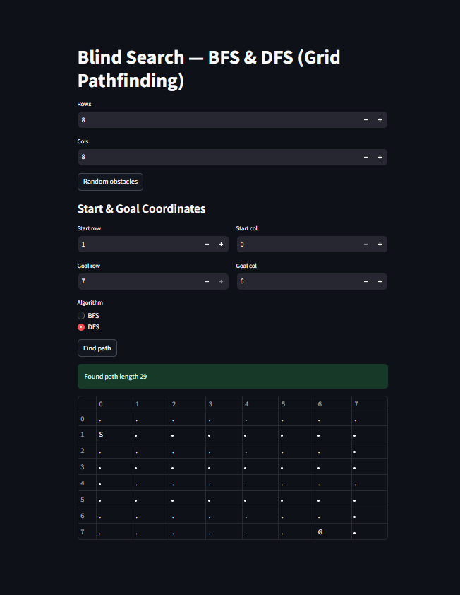
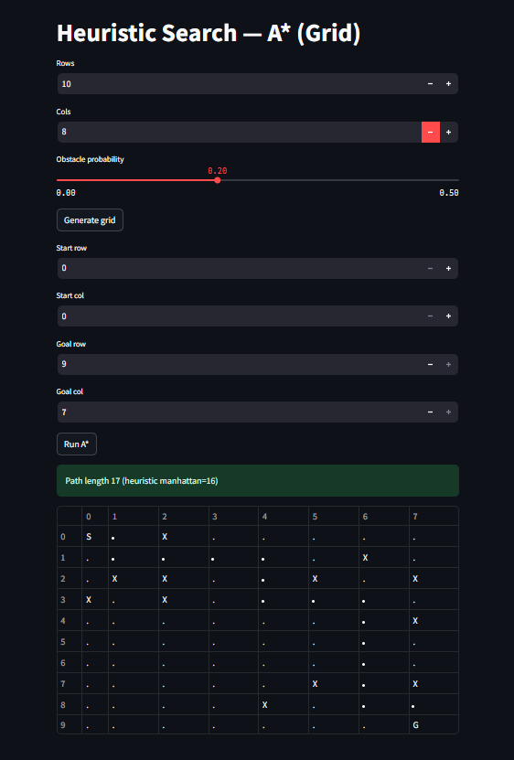
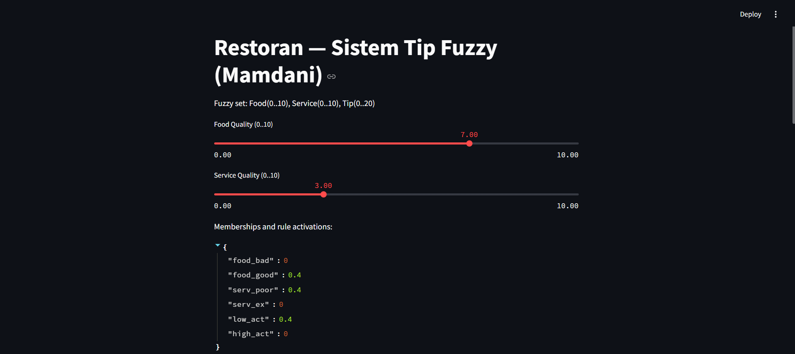
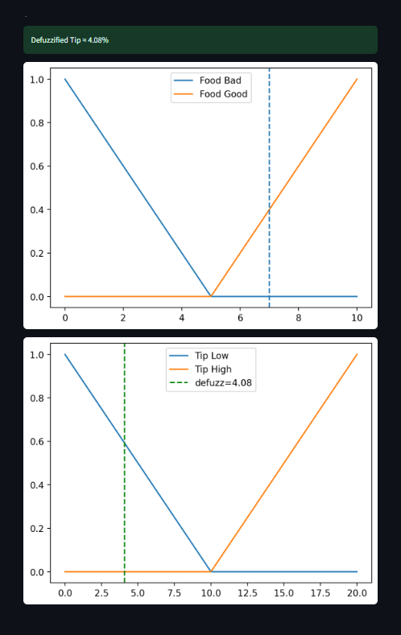
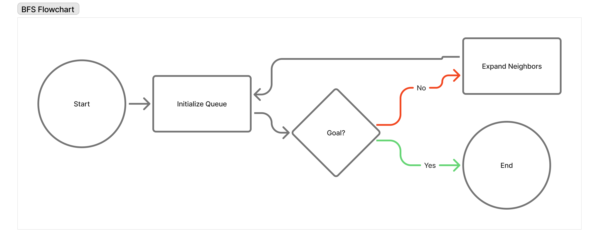
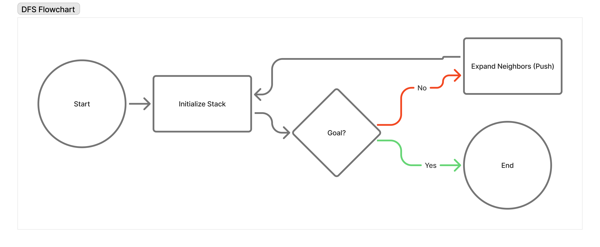
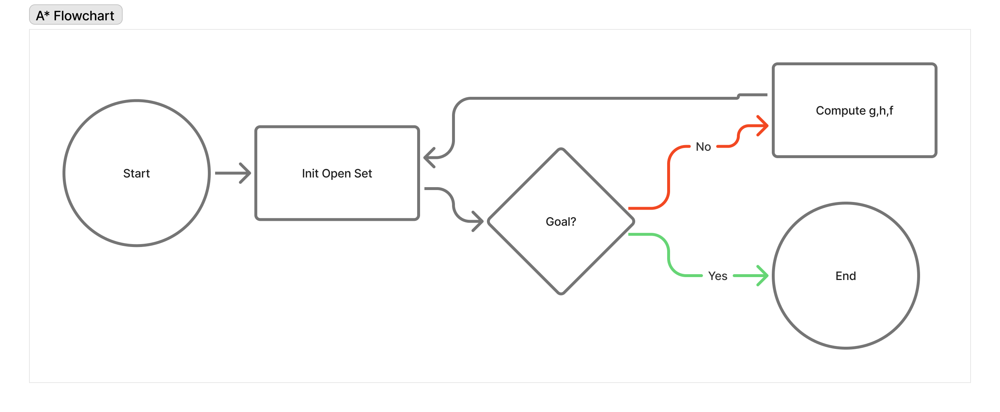
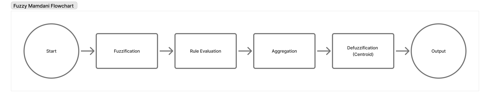

# 📘 Artificial Intelligence Projects  
### **Zainal Fattah — 32602300013**

Repository ini berisi tiga proyek implementasi algoritma Kecerdasan Buatan (AI) menggunakan **Python** dan **Streamlit**:

1. **Blind Search (BFS & DFS)**
2. **Heuristic Search (A*)**
3. **Fuzzy Logic (Sistem Penilaian Tip Restoran)**

---

## 👤 Identitas Mahasiswa
| Informasi          | Keterangan                            |
|--------------------|---------------------------------------|
| **Nama**           | Zainal Fattah                         |
| **NIM**            | 32602300013                           |
| **Mata Kuliah**    | Artificial Intelligence               |
| **Dosen Pengampu** | Sam Farisa Chaerul Haviana, ST., M.Kom|
+------------------------------------------------------------+

# 📁 Struktur Folder Proyek
```
UTS-Kecerdasan-Buatan/
├─ README.md
├─ requirements.txt
├─ Blind_Search/
│  ├─ streamlit_app.py
│  └─ utils.py
├─ Heuristic_Search/
│  ├─ streamlit_app.py
│  └─ utils.py
└─ Restoran_Fuzzy/
   ├─ streamlit_app.py
   └─ fuzzy_utils.py
```

---

# 🖼️ Screenshot Aplikasi
### **1) BFS & DFS Simulation**


### **2) A\* Simulation**


### **3) Fuzzy Tip System**



---

# 🔍 Flowchart Algoritma 
### **1️⃣ Flowchart BFS**


---

### **2️⃣ Flowchart DFS**


---

### **3️⃣ Flowchart A\***


---

### **4️⃣ Flowchart Logika Fuzzy**


---

# 🚀 Cara Menjalankan Proyek

## 1. Install Dependensi
```bash
pip install -r requirements.txt
```

## 2. Jalankan Setiap Project
### 🔍 Blind Search (BFS & DFS)
```bash
cd Blind_Search
streamlit run streamlit_app.py
```
### 🧭 Heuristic Search (A*)
```bashcd Heuristic_Search
streamlit run streamlit_app.py
cd Heuristic_Search
streamlit run streamlit_app.py
```
### 🍽️ Fuzzy Logic — Tip Restoran
```bash
cd Restoran_Fuzzy
streamlit run streamlit_app.py
```

# 🚀 Deskripsi Singkat Setiap Proyek
### 🔍 Project 1 — Blind Search (BFS & DFS)
Folder: /Blind_Search

Project ini mengimplementasikan dua algoritma pencarian buta:
* BFS (Breadth-First Search) → mencari jalur terpendek pada grid apabila tanpa bobot
* DFS (Depth-First Search) → menelusuri node secara mendalam terlebih dahulu

Fitur dalam aplikasi Streamlit:
* Membuat grid secara dinamis
* Menentukan titik Start dan Goal
* Menambahkan rintangan (obstacle)
* Menampilkan path hasil BFS atau DFS dalam bentuk tabel

Tujuan Pembelajaran
* Memahami bedanya pencarian buta yang tidak menggunakan heuristik
* Mengetahui sifat algoritma BFS (lengkap & optimal) dan DFS (tidak optimal)

### 🧭 Project 2 — Heuristic Search (A)*
Folder: /Heuristic_Search

Mengimplementasikan algoritma:
* A (A-Star) Search* dengan heuristik Manhattan Distance
* A* adalah algoritma pencarian dengan heuristik yang terkenal efisien dan optimal untuk grid.

Fitur aplikasi:
* Grid generator dengan probabilitas obstacle
* Start & Goal dapat dipilih
* Menampilkan open/closed set secara visual (opsional pengembangan)
* Menampilkan path hasil A*

Tujuan Pembelajaran
* Memahami pencarian heuristik
* Memahami konsep g(n), h(n), dan f(n)=g+h
* Membandingkan A* dengan BFS/DFS

### 🍽️ Project 3 — Logika Fuzzy (Sistem Penilaian Tip Restoran)
Folder: /Restoran_Fuzzy

Mengimplementasikan sistem fuzzy Mamdani berdasarkan dua input:
* Food Quality (0–10)
* Service Quality (0–10)

Output:
* Tip (%) pada range 0–20

Menggunakan membership function:
* Food → Bad, Good
* Service → Poor, Excellent
* Tip → Low, High

Fitur aplikasi:
* Slider input Food & Service
* Menampilkan nilai membership
* Menampilkan aktivasi rule fuzzy
* Visualisasi grafik membership (Food & Tip)
* Defuzzifikasi menggunakan centroid method

Contoh Perhitungan dari Soal
Untuk input:
* Food = 7
* Service = 3
Didapatkan tip ≈ 4.08%

**Perhitungan tangan (kasus soal): Food=7, Service=3**
(from infer_tip logic — saya hitung manual dan cocok dengan kode di atas)

1. Membership:
   * Food Good (tri (5,10,10)) pada x=7 → μ_food_good = (7-5)/(10-5) = 2/5 = 0.4
   * Food Bad (tri (0,0,5)) pada x=7 → μ_food_bad = 0.0
   * Service Poor (tri (0,0,5)) pada x=3 → μ_serv_poor = (5-3)/(5-0) = 2/5 = 0.4
   * Service Excellent (tri (5,10,10)) pada x=3 → μ_serv_ex = 0.0
2. Rule activations:
   * R1 (Service Poor OR Food Bad) → max(0.4, 0.0) = 0.4 → activates Tip=Low at 0.4
   * R2 (Service Excellent AND Food Good) → min(0.0,0.4) = 0.0 → Tip=High not aktif
3. Agregasi & defuzzifikasi (Mamdani / centroid) — hanya activating Low clipped at 0.4. Jika dihitung centroid (integral numerik) pada universe tip 0..20 hasilnya:
  * Tip ≈ 4.08%

# 🏁 Kesimpulan
Repository ini berisi tiga implementasi fundamental AI yang umum dipelajari dalam mata kuliah Kecerdasan Buatan:
* Pencarian buta (BFS/DFS)
* Pencarian heuristik (A)*
* Sistem berbasis fuzzy (Mamdani)
Semua disediakan dalam bentuk aplikasi visual interaktif menggunakan Streamlit, sehingga memudahkan simulasi dan pemahaman konsep.